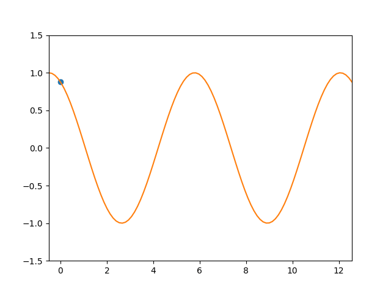

### Simple physics simulation experiments

This repository is all about me having fun experimenting with building a relatively simple physics simulation.

This repository has two implementations: one for simulating an object that follows a two dimensional curve $(t,f(t))$ for some real valued function $f$, being affected by gravity, and one for simulating an object that lies on a surface in 3D given a surface $(x,y,f(x,y))$.

The below shows some examples (some timescaling is off here, but it's still pretty cool):

Trajectory and position analysis (example):

#### Derivation equations

Here I will explain where the equations of motions come from which the simulation uses.

##### Curve simulation

We first start with the given parametrisation of a curve in 2D: $y(x)=(x,f(x))$. We then find an arc-length reparametrisation $\gamma(s)=y(S^{-1}(s))$ where

$S(s)=\int_{0}^{s}||y'(x)||dx=\int_{0}^{s}\sqrt{1+f'(x)^2}dx

We find $S^{-1}$ by numerical computation.

However, we want the parameter $s$ to depend on time (since the object does not move with constant speed, but with a speed influenced by gravity). Thus we need to find the actual correct parametrisation of the curve: $x(t)=\gamma(s(t))$.

Differentiating once yields:

$x'(t)=\gamma'(s(t))s'(t)=T(s(t))v(t)$

where $T=\gamma'$ is the unit tangent vector (along the curve) and $v=s'$ is the velocity (scalar).

Differentiating again yields:

$x''(t)=T'(s(t))v(t)^2+T(s(t))v'(t)$

Using $T'(s)=K(s)N(s)$ (from the Frenet formulas), and $a(t)=v'(t)$:

$x''(t)=K(s(t))v(t)^2N(s(t))+a(t)T(s(t))

Here, the first term represents the centripetal acceleration, in the direction of $N(s(t))$ and the second represents the tangential acceleration, in the direction of $T(s(t))$.

We know that, by Newton's (first, second or third, I can't remember) law, $x''(t)=(0,-g)$, so the total acceleration is just the net acceleration, being gravity in this case. Setting these equal we get

$(0,-g)=K(s(t))v(t)^2N(s(t))+a(t)T(s(t))$

We can now multiply by $T(s(t))$ on both sides (inner product):
$(0,-g)\cdot T(s(t))=a(t)$
The left term vanishes (because $T$ and $N$ form an orthonormal basis) and the second becomes just $a(t)$, because $T$ is unitary. Finally, we add a friction term which will damp the solution, based on the Coulomb + viscous friction (I just looked up some friction models). We thus become the following system of ODEs:

$v'(t)=(0,-g)\cdot T(s(t))-g\mu\cdot\text{sign}(v(t))+\alpha |v(t)| v$
$s'(t)=v(t)$

where $\alpha$ is a small scalar, in my simulation chosen to be 0.1.
We can solve this for $s$ and $v$ numerically. Thus we have found the solution of the system, yielding the travelled distance $s(t)$ after $t$ seconds and the scalar velocity $v(t)$ after $t$ seconds.

I derived this equation somewhat by myself, with the help of some google-searching and AI-prompting (and reading through my differential geometry course).

##### Surface simulation

This article basically describes the exact thing I'm doing here:

https://www.sciencedirect.com/science/article/pii/S2095034919300200

First we note that the parametrisation for the surface in 3D we use is of the form

$F(x,y)=(x,y,f(x,y))$

Then we compute the normal vector:

$N(F(x,y))=(-\frac{df}{dx},-\frac{df}{dy},1) / ||(-\frac{df}{dx},-\frac{df}{dy},1)||

We will denote this by $n$.

We then define the matrix $P$ as the linear operator which projects onto the tangent plane (perpendicular to $n$):

$P=I-nn^{T}$

This matrix of course depends on the position vector $r$.

We first decompose the acceleration vector $r''$ as:

$r''=g+\lambda n$

such that it has a pure gravitational component and a normal component. We then apply the projection $P$:

$Pr''=Pg+Pn$

but because $Pn=0$ and we want that $r''$ is tangent, we get

$r''=Pg=(I-nn^{T})g=g-(g\cdot n)n$

where $P$ depends on the position $r$ of course.

Another way to see it is: the desired acceleration $r''$ should be the tangent component of gravity.

We can also add friction to this, to make it more realistic:

$r''=Pg+\mu |r'|r'

If we write this out in coordinates, we get the system of ODEs

$x''=-g\cdot f_x/D-\mu |v|x'$
$y''=-g\cdot f_y/D-\mu |v|y'$
$z''=-g\cdot g/D-\mu |v|z'$

where

$D=\sqrt{1+f_{x}^2+f_{y}^2}$,
$v=r'=\sqrt{(x')^2+(y')^2+(z')^2}$

