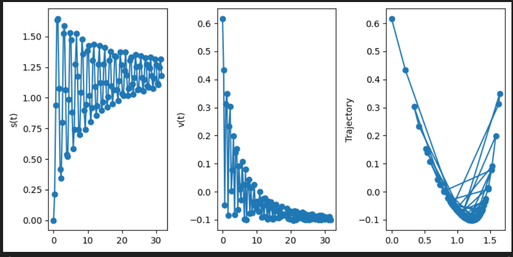

### Simple physics simulation experiments

This repository is all about me having fun experimenting with building a relatively simple physics simulation that computes the exact positions and velocities at each timestamp, where an object follows a curve $(t,f(t))$ given some real-valued function $f$.

The below shows some examples (there is a slight issue with the time-to-animation mapping but nonetheless pretty cool imo):

Trajectory and position analysis (example):

#### Derivation equations

Here I will explain where the equations of motions come from which the simulation uses.

We first start with the given parametrisation of a curve in 2D: $y(x)=(x,f(x))$. We then find an arc-length reparametrisation $\gamma(s)=y(S^{-1}(s))$ where

$S(s)=\int_{0}^{s}||y'(x)||dx=\int_{0}^{s}\sqrt{1+f'(x)^2}dx

We find $S^{-1}$ by numerical computation.

However, we want the parameter $s$ to depend on time (since the object does not move with constant speed, but with a speed influenced by gravity). Thus we need to find the actual correct parametrisation of the curve: $x(t)=\gamma(s(t))$.

Differentiating once yields:

$x'(t)=\gamma'(s(t))s'(t)=T(s(t))v(t)$

where $T=\gamma'$ is the unit tangent vector (along the curve) and $v=s'$ is the velocity (scalar).

Differentiating again yields:

$x''(t)=T'(s(t))v(t)^2+T(s(t))v'(t)$

Using $T'(s)=K(s)N(s)$ (from the Frenet formulas), and $a(t)=v'(t)$:

$x''(t)=K(s(t))v(t)^2N(s(t))+a(t)T(s(t))

Here, the first term represents the centripetal acceleration, in the direction of $N(s(t))$ and the second represents the tangential acceleration, in the direction of $T(s(t))$.

We know that, by Newton's (first, second or third, I can't remember) law, $x''(t)=(0,-g)$, so the total acceleration is just the net acceleration, being gravity in this case. Setting these equal we get

$(0,-g)=K(s(t))v(t)^2N(s(t))+a(t)T(s(t))$

We can now multiply by $T(s(t))$ on both sides (inner product):
$(0,-g)\cdot T(s(t))=a(t)$
The left term vanishes (because $T$ and $N$ form an orthonormal basis) and the second becomes just $a(t)$, because $T$ is unitary. We thus become the following system of ODEs:

$v'(t)=(0,-g)\cdot T(s(t))$
$s'(t)=v(t)$

We can solve this for $s$ and $v$ numerically. Thus we have found the solution of the system, yielding the travelled distance $s(t)$ after $t$ seconds and the scalar velocity $v(t)$ after $t$ seconds.

I derived this equation somewhat by myself, with the help of some google-searching and AI-prompting (and reading through my differential geometry course).

